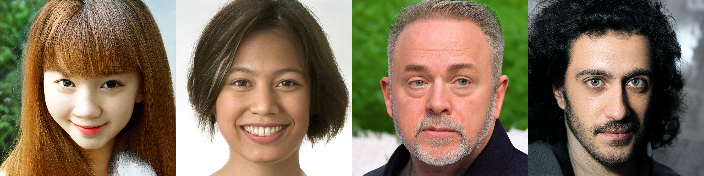
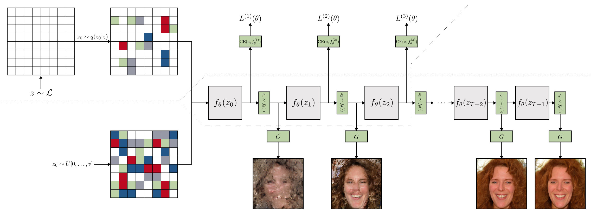

# Megapixel Image Generation with Step-unrolled Denoising Autoencoders

[Paper](https://arxiv.org/abs/2206.12351) | [Twitter Summary](https://twitter.com/alexfmckinney/status/1541350462460493828)

Code for my master's dissertation into fast sampling of VQ-GAN latents using
step-unrolled denoising autoencoders (SUNDAE).


> Representative FFHQ1024 outputs, sampled in only 2 seconds on a GTX 1080Ti

The paper combines non-autoregressive text model SUNDAE with a powerful
pretrained VQ-GAN and efficient transformer backbone (Hourglass Transformers)
to produce a fast image generation framework. This framework was successfully
scaled to 1024x1024 images and can produce diverse and realistic samples in
approximately 2 seconds on a GTX 1080Ti. Furthermore, it was the first work to
demonstrate both scaling of SUNDAE to long sequence lengths and VQ-GAN to
megapixel images. Perceptual quality metrics such as FID were not state of the
art, but I hope the method and code is useful to the community, as well
encouraging further exploration of non-autoregressive discrete models.


> Overview of SUNDAE-VQGAN Training and Sampling

This repository contains:
- `generate-latents.py`: latent dataset generation script using trained VQ-GAN.
- `train.py`: training script for SUNDAE discrete prior.
- `sample.py`: non-interactive sampling script using trained SUNDAE prior and VQ-GAN.
- `sample.py`: interactive sampling script using trained SUNDAE prior and VQ-GAN.
- `inpaint.py`: inpainting script using trained SUNDAE prior and VQ-GAN.
- `generate-discrete-mnist`: generates a psuedo-latent dataset from MNIST style dataset.
- `recon-vqgan.py`: reconstruction script using trained VQ-GAN.
- `utils.py`: miscellaneous utility functions.
- `config/`: configuration toml/yaml files for all experiments.
- `hourglass_transformer/`: a forked PyTorch reimplementation of hourglass
  transformers by [@lucidrains](https://github.com/lucidrains). This
  implementation has been heavily modified as detailed in the paper.

See arguments in each file for detailed usage.

All models are implemented in PyTorch. Training scripts are implemented using
[ptpt](https://github.com/vvvm23/ptpt) - my lightweight framework around
PyTorch.

Before applying to image, I reimplemented SUNDAE on the text8 dataset. This can
be found [here](https://github.com/vvvm23/sundae).

## Installation

Create a python environment, then install requirements as follows:
```
pip install -r requirements.txt
```

Place the datasets you wish to train on in a directory named `data/`, in format
suitable for `torchvision.datasets.ImageFolder`.

Download pretrained VQ-GAN checkpoints and place them in a directory named
`vqgan-ckpt/`. Any checkpoint in the same format as
[taming-transformers](https://github.com/CompVis/taming-transformers) is suitable.

> If the checkpoint is a combined VQ-GAN + GPT prior, add ``--legacy-cfg`` as
> an additional argument to scripts that use VQ-GAN. To be explicit, if the
> config you downloaded contains keywords such as `transformer_config` or
> `first_stage_config` you should use this flag.

`TODO: add support for latent diffusion style VQ-GAN`

## Usage

Generate the latent dataset as follows:
```
python generate-latents.py \
    --cfg-path config/vqgan/ffhq1024.yaml \
    --ckpt-path vqgan-ckpt/ffhq1024.ckpt \
    --dataset-in data/ffhq1024 \
    --latents-out data/ffhq1024-latents
```
If you wish to use class data, add the argument `--use-class`. However,
class-conditioned experiments, with the exception of MNIST, led to poor
results.

---

Train SUNDAE on the latent dataset as follows:
```
python train.py --cfg-path config/ffhq1024/config.toml
```
If you wish to use wandb tracking, add the argument `--wandb`.

---

Run an interactive sampling script as follows:
```
python sample-interactive.py \
    --cfg-path config/ffhq1024/config.toml \
    --resume sundae-ckpt/ffhq1024.pt
```
If your GPU has enough memory, you can use the argument `--cuda-vqgan` to also
load VQ-GAN onto the GPU. Otherwise, it will decode latents on CPU.

If you wish to generate samples in bulk, you can use the script `sample.py`.
This is useful for calculating metrics such as FID.

## Configuration

`config/vqgan` contains yaml files defining the VQ-GAN configuration. These are
in the same format as
[taming-transformers](https://github.com/CompVis/taming-transformers) and
should be packaged with the downloaded pretrained checkpoint.

All other subdirectories of `config/` contain configs for each dataset. These
are structured as follows:
- `unroll_steps`: number of Markov unroll steps during training
- `[trainer]`: configuration options passed to `ptpt.Trainer`
- `[data]`: configuration options passed to the latent dataset
- `[vqgan]`: defines where to find VQ-GAN config, checkpoint, and the shape of
  its latent.
- `[sampling]`: configuration options for sampling during evaluation stage of training.
- `[net]`: configuration options for hourglass transformer architecture.

## Pretrained Checkpoints
`TODO: track these down`

---

### Reference

This work takes strong inspiration from the following papers:

**Step-unrolled Denoising Autoencoders for Text Generation**
> Nikolay Savinov, Junyoung Chung, Mikolaj Binkowski, Erich Elsen, Aaron van den Oord

```
@misc{savinov2022stepunrolled,
      title={Step-unrolled Denoising Autoencoders for Text Generation}, 
      author={Nikolay Savinov and Junyoung Chung and Mikolaj Binkowski and Erich Elsen and Aaron van den Oord},
      year={2022},
      eprint={2112.06749},
      archivePrefix={arXiv},
      primaryClass={cs.CL}
}
```

**Taming Transformers for High-Resolution Image Synthesis**
> Patrick Esser, Robin Rombach, Björn Ommer

```
@misc{esser2021taming,
      title={Taming Transformers for High-Resolution Image Synthesis}, 
      author={Patrick Esser and Robin Rombach and Björn Ommer},
      year={2021},
      eprint={2012.09841},
      archivePrefix={arXiv},
      primaryClass={cs.CV}
}
```

**Hierarchical Transformers Are More Efficient Language Models**
> Piotr Nawrot, Szymon Tworkowski, Michał Tyrolski, Łukasz Kaiser, Yuhuai Wu, Christian Szegedy, Henryk Michalewski

```
@misc{nawrot2021hierarchical,
      title={Hierarchical Transformers Are More Efficient Language Models}, 
      author={Piotr Nawrot and Szymon Tworkowski and Michał Tyrolski and Łukasz Kaiser and Yuhuai Wu and Christian Szegedy and Henryk Michalewski},
      year={2021},
      eprint={2110.13711},
      archivePrefix={arXiv},
      primaryClass={cs.LG}
}
```

### Citation
**Megapixel Image Generation with Step-unrolled Denoising Autoencoders**
> Alex F. McKinney, Chris G. Willcocks
```
@misc{mckinney2022megapixel,
      title={Megapixel Image Generation with Step-Unrolled Denoising Autoencoders}, 
      author={Alex F. McKinney and Chris G. Willcocks},
      year={2022},
      eprint={2206.12351},
      archivePrefix={arXiv},
      primaryClass={cs.CV}
}
```
